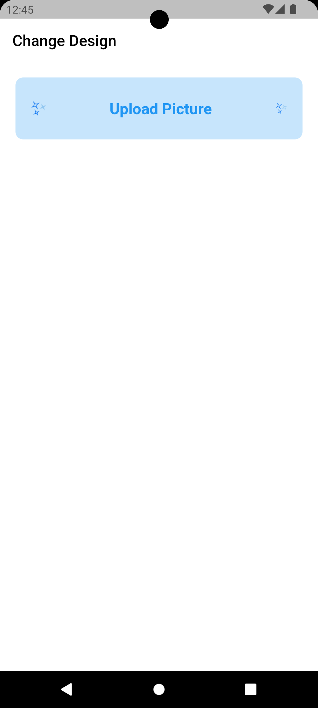
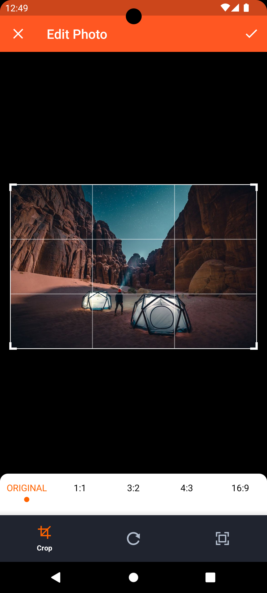
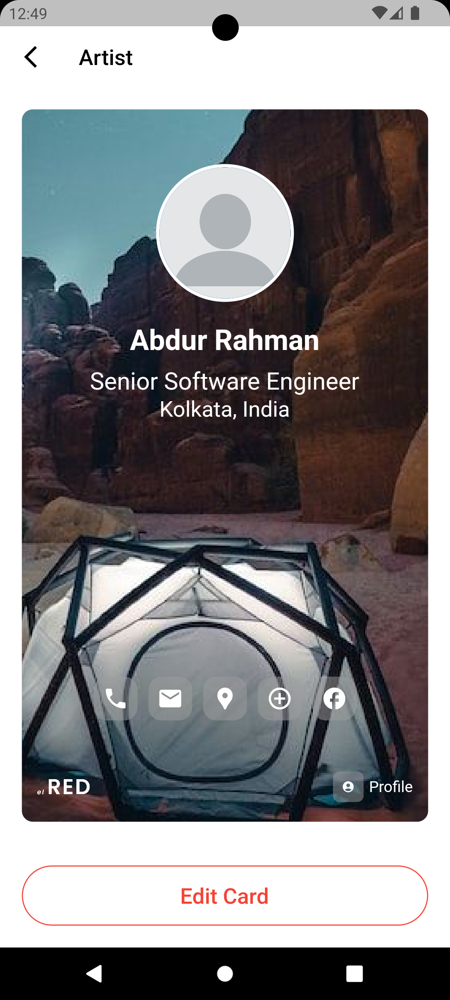
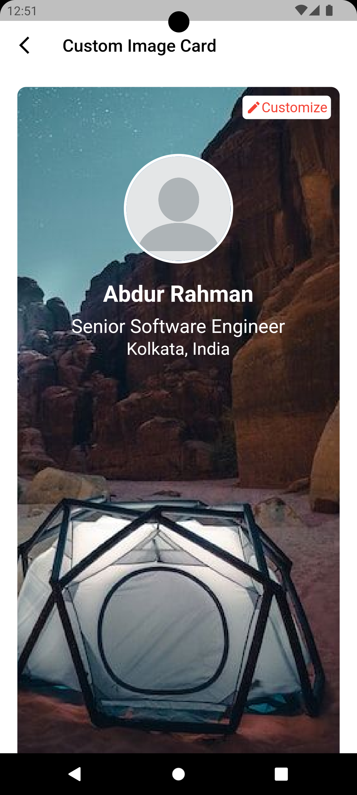

# Flutter Photo Editing App

## Screenshots
   

   

## Description

This is a Flutter mobile application that allows users to edit and customize photos. Users can upload images, adjust their positions, scales, and perform basic photo editing tasks. The application includes features such as:

- Uploading images from the device's gallery or camera.
- Adjusting the position and scale of the uploaded images.

## Features

- **Image Upload**: Users can upload images from their device's gallery or take a new photo using the camera.

- **Photo Customization**: Users can adjust the position and scale of the uploaded images to customize their appearance.

- **Basic Editing**: The app provides basic editing tools to enhance photos, such as rotation and scaling.

- **Profile Card Creation**: Users can create profile cards with customized photos and information.

## Getting Started

Follow these instructions to get a copy of the project up and running on your local machine for development and testing purposes.

### Prerequisites

- [Flutter](https://flutter.dev/docs/get-started/install)

### Installation

1. Clone the repository to your local machine:

   ```bash
   git clone https://github.com/abr13/elred_photoPanning.git
